---
output:
  html_document: default
  pdf_document: default
---
# Colegio Horizonte - Sistema de Gestión Escolar

**Autor:** Yhoner Toro  
**Asignatura:** Desarrollo Web  
**Descripción:** Implementación de base de datos en múltiples motores (MySQL, PostgreSQL, SQL Server y Oracle) utilizando Docker y herramientas de administración gráfica.

---

## Introducción

En este documento se presenta la implementación de una base de datos relacional para el sistema **Colegio Horizonte** en cuatro motores de bases de datos:

- MySQL
- PostgreSQL
- SQL Server
- Oracle

La creación de cada esquema se realizó desde la consola de Ubuntu utilizando contenedores Docker, y su administración y visualización se gestionó a través de herramientas gráficas como DBeaver, pgAdmin 4, MySQL Workbench y SQL Server Management Studio.

---

## 1. Gestión de contenedores Docker

Para iniciar el proceso, se verificó el estado de todos los contenedores disponibles en el sistema y se activaron los correspondientes a cada motor de base de datos:

```bash
docker ps -a
docker start mysql-server
docker start postgres-server
docker start mssql-server
docker start oracle-xe
```

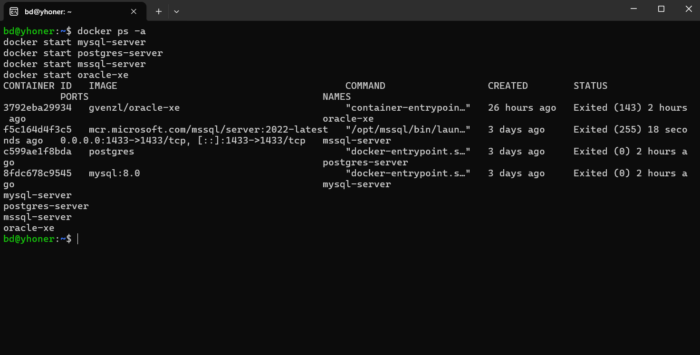

---

# 2. Motor MySQL

## 2.1 Acceso a MySQL desde Docker

Se accedió al motor MySQL ejecutando el siguiente comando desde la terminal de Ubuntu. Este comando permite ingresar directamente al cliente de MySQL dentro del contenedor en ejecución:

```bash
docker exec -it mysql-server mysql -u root -p
```

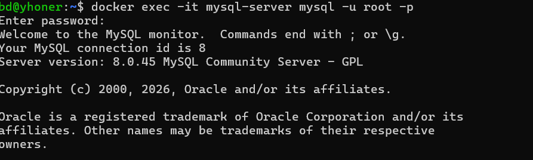

## 2.2 Verificación de bases de datos

Una vez dentro del motor, se ejecutó el siguiente comando para listar las bases de datos existentes y confirmar que el entorno se encontraba operativo:

```sql
SHOW DATABASES;
```

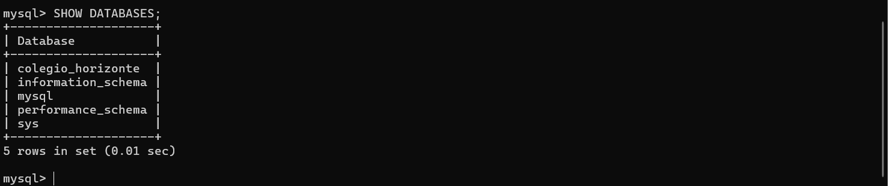

## 2.3 Conexión desde DBeaver

Para la administración y visualización de la base de datos se estableció la conexión al motor MySQL utilizando DBeaver. Esta herramienta permite gestionar bases de datos de manera gráfica, facilitando la visualización de tablas, relaciones y la ejecución de consultas SQL.

La conexión se configuró con los siguientes parámetros:

- **Host:** 172.18.57.107
- **Puerto:** 3306
- **Usuario:** root
- **Contraseña:** (la configurada en el contenedor)

Una vez establecida la conexión, se verificó la existencia de la base de datos y sus tablas. DBeaver permitió además generar diagramas entidad-relación y validar la integridad del modelo de datos de forma visual.

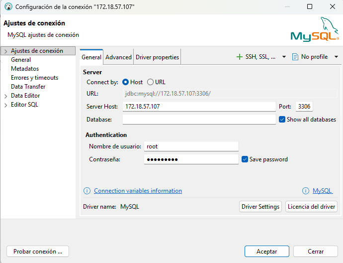

---

## 2.4 Creación de tablas en MySQL

Para el sistema Colegio Horizonte se diseñó un conjunto de ocho tablas interrelacionadas mediante llaves primarias y foráneas, garantizando la integridad referencial del modelo. A continuación se documenta la creación de cada tabla.

### Tabla: students

La tabla **students** almacena la información personal de cada estudiante registrado en el sistema. Fue la primera tabla en crearse, dado que otras tablas dependen de ella mediante llave foránea. Se optó por crearla directamente desde la terminal de Ubuntu para familiarizarse con el entorno de consola.

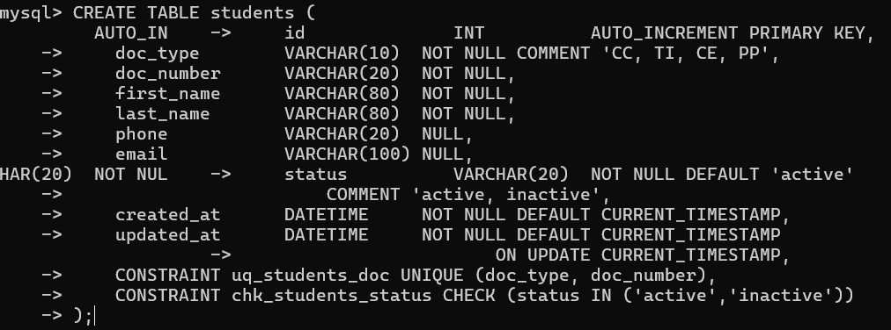

La tabla fue creada exitosamente y se reflejó de inmediato al actualizar el explorador de DBeaver.

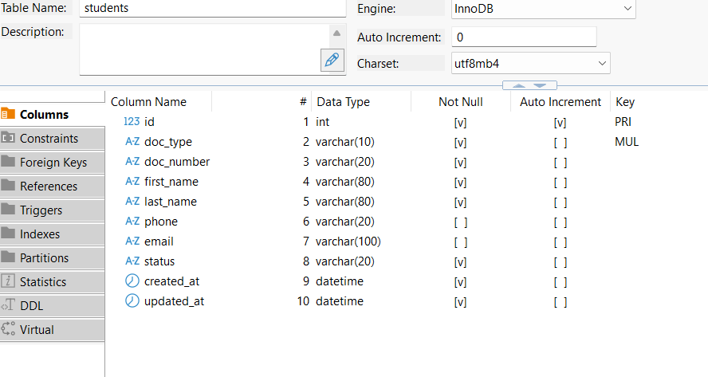

### Tabla: guardians

La tabla **guardians** almacena la información de los acudientes o responsables de cada estudiante. Se relaciona con la tabla **students** mediante una llave foránea, permitiendo asociar uno o más acudientes a un estudiante específico.

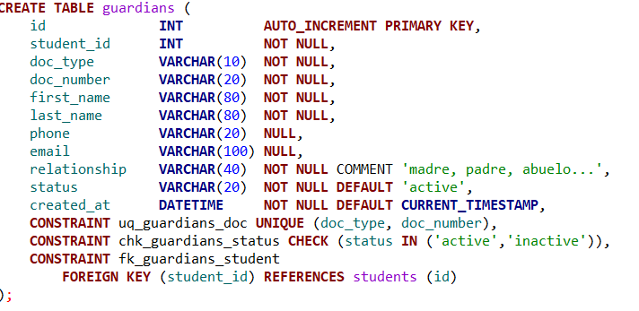

### Tabla: school_groups

La tabla **school_groups** almacena la información de los grupos o salones del colegio, organizados por grado y periodo académico. Esta tabla es referenciada por **enrollments** y **courses**, siendo un eje central del modelo.

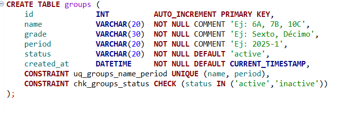

### Tabla: enrollments

La tabla **enrollments** registra las matrículas de los estudiantes, vinculando cada estudiante con un grupo específico. Es una tabla fundamental del sistema, ya que conecta la información académica y habilita la gestión de asistencia, calificaciones y pagos.

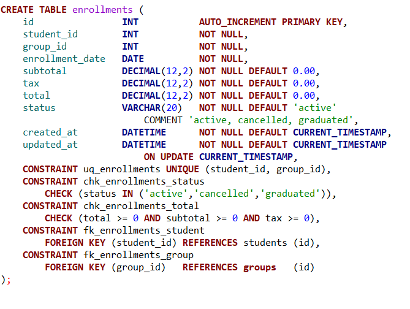

### Tabla: courses

La tabla **courses** almacena las asignaturas o materias impartidas en el colegio. Cada curso está asociado a un grupo, lo que permite organizar la carga académica y gestionar la asistencia y calificaciones de los estudiantes matriculados.

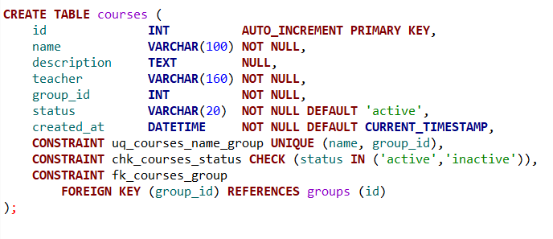

### Tabla: attendances

La tabla **attendances** registra la asistencia diaria de los estudiantes por curso y fecha. Controla el estado de cada registro mediante los valores `present`, `absent`, `late` y `excused`, siendo fundamental para el seguimiento académico.

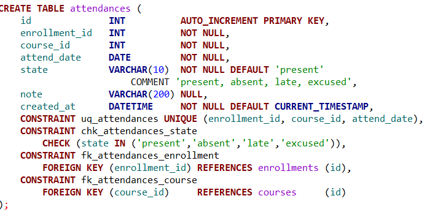

### Tabla: grades

La tabla **grades** almacena las calificaciones obtenidas por los estudiantes en cada curso y periodo académico. Permite llevar un control detallado del rendimiento académico, asociando cada nota a una matrícula y a una asignatura específica.

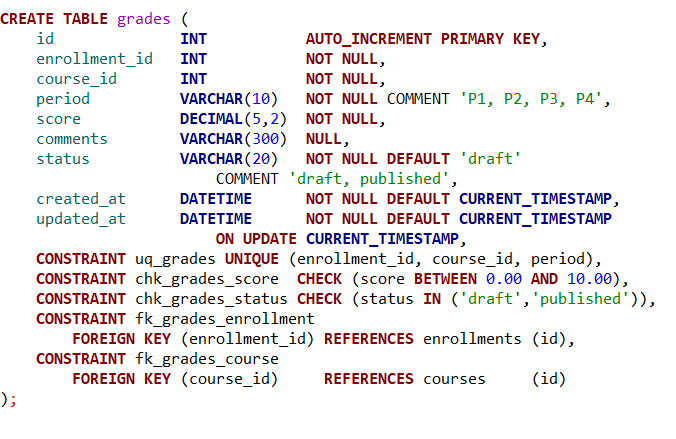

### Tabla: tuition_payments

La tabla **tuition_payments** registra los pagos de mensualidad realizados por cada estudiante, vinculándolos a su matrícula. Incluye información como método de pago, monto, fechas de pago y vencimiento, y el estado del cobro.

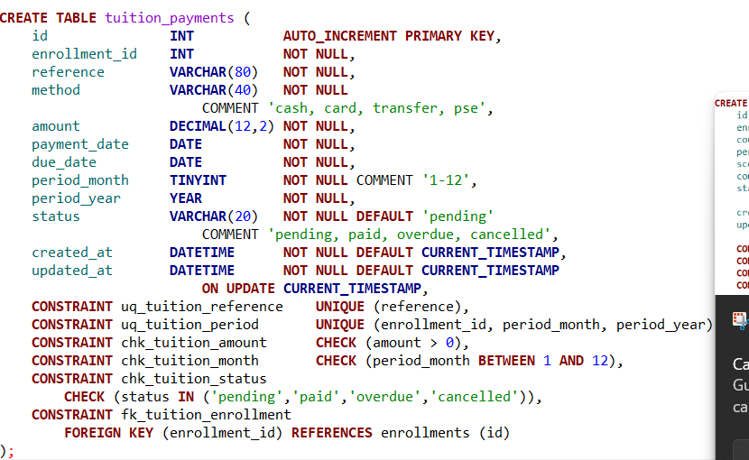

---

## 2.5 Diagrama entidad-relación en DBeaver

Una vez creadas todas las tablas, se generó el diagrama entidad-relación desde DBeaver. Este diagrama permite visualizar gráficamente la estructura del modelo, mostrando las relaciones entre entidades mediante llaves primarias y foráneas.

En el modelo se observa que **students** actúa como entidad principal, relacionándose con **guardians** y **enrollments**. A su vez, **enrollments** conecta con **school_groups** para ubicar al estudiante en un grupo. Las tablas **attendances** y **grades** dependen tanto de la matrícula como del curso, mientras que **tuition_payments** se vincula directamente con **enrollments** para el control financiero.

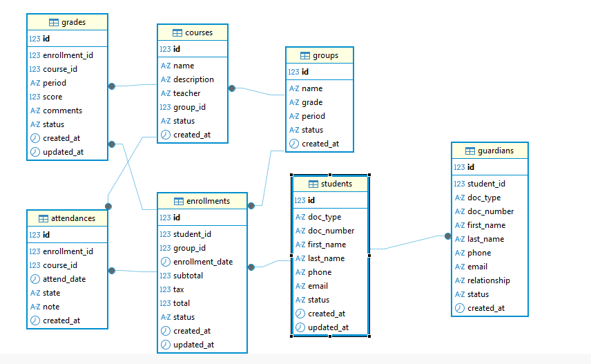

---

# 2.6 MySQL Workbench

## Inicio del entorno

Se verificó que el contenedor de MySQL estuviera en ejecución desde Ubuntu, confirmando la disponibilidad del servicio para conexiones externas.

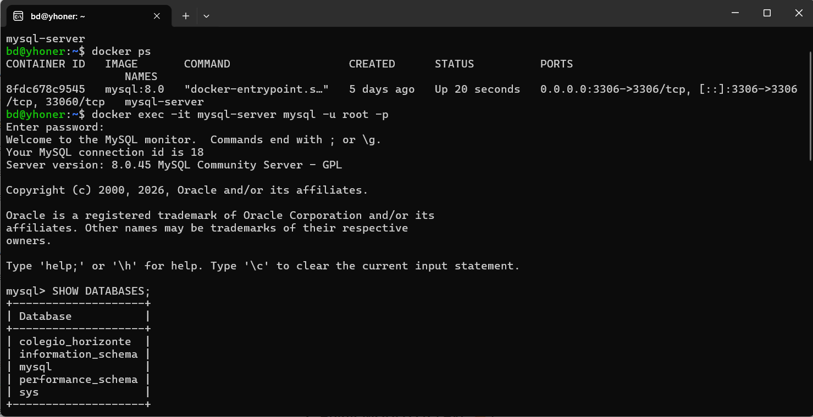

Con la IP del servidor identificada, se procedió a establecer la conexión desde **MySQL Workbench**, herramienta oficial de Oracle para la administración de bases de datos MySQL.

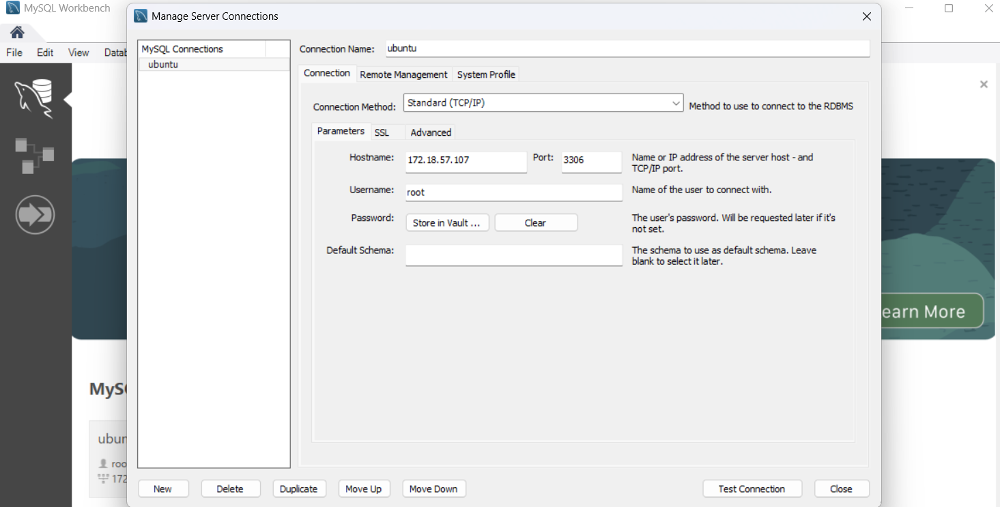

Finalmente, se visualizó el diagrama entidad-relación desde Workbench para verificar que el modelo de datos se encontraba correctamente estructurado.

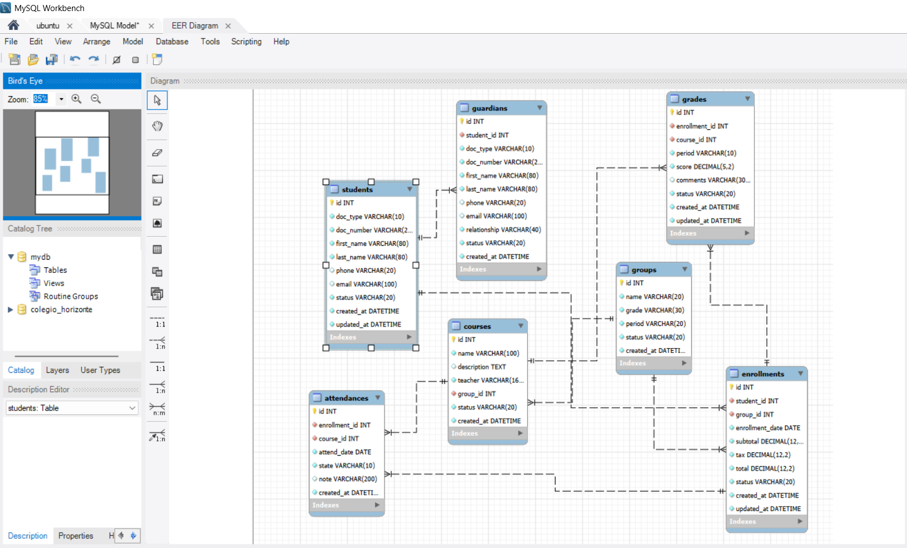

---

# 3. Motor PostgreSQL

## 3.1 Inicio del entorno

Se inició el contenedor de PostgreSQL desde la terminal de Ubuntu, verificando que el servicio se encontrara activo y disponible para recibir conexiones externas:

```bash
docker start postgres-server
docker ps
```

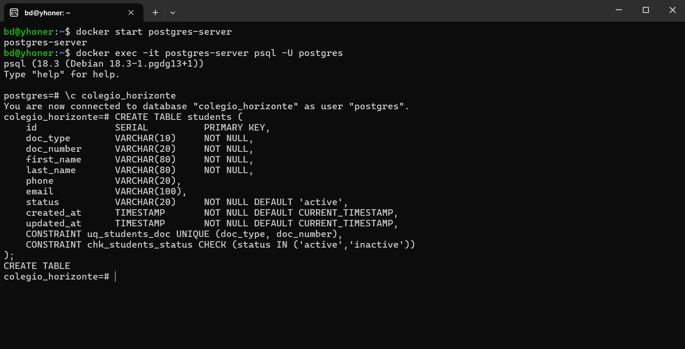

## 3.2 Conexión desde DBeaver

Con el contenedor en ejecución, se estableció la conexión a la base de datos desde DBeaver configurando los parámetros de host, puerto y credenciales correspondientes al contenedor.

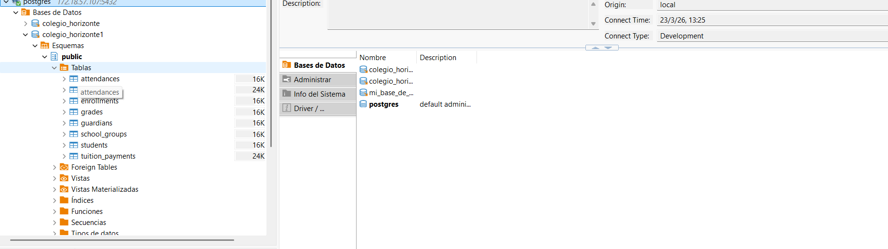

## 3.3 Diagrama de tablas en DBeaver

Con la conexión activa, se exploró el esquema de la base de datos desde DBeaver, verificando la presencia de todas las tablas creadas y sus relaciones.


## 3.4 Conexión desde pgAdmin 4

Se realizó adicionalmente la conexión a la misma instancia de PostgreSQL utilizando **pgAdmin 4**, registrando el servidor con los datos del contenedor Docker. Esta herramienta ofrece una interfaz web completa para la administración del motor PostgreSQL.


## 3.5 Diagrama ER en pgAdmin 4

Desde pgAdmin 4 se generó el diagrama entidad-relación, permitiendo visualizar de forma gráfica la estructura completa del modelo y las relaciones entre sus tablas.


---

# 4. Motor SQL Server

## 4.1 Levantamiento del contenedor

Se desplegó el contenedor de SQL Server 2022 utilizando la imagen oficial de Microsoft. Durante el proceso se presentó un error inicial relacionado con la política de contraseñas del motor, el cual fue resuelto estableciendo una contraseña que cumpliera los requisitos de complejidad (mayúsculas, minúsculas, números y símbolos).

```bash
docker run -e "ACCEPT_EULA=Y" -e "MSSQL_SA_PASSWORD=MiPassword123!" \
  -p 1433:1433 --name sqlserver -d \
  mcr.microsoft.com/mssql/server:2022-latest

docker ps
```

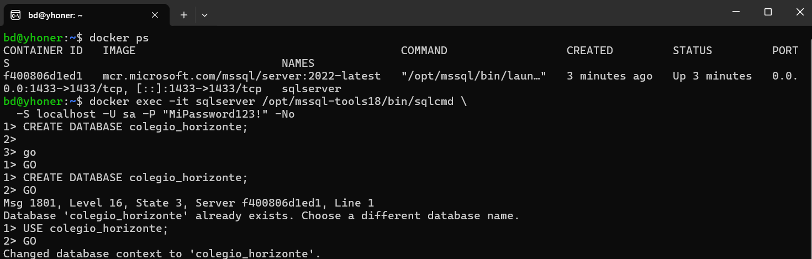

## 4.2 Acceso al motor desde la terminal

Se accedió al motor utilizando `sqlcmd`, la herramienta de línea de comandos de SQL Server. Dado que la versión 2022 instala las herramientas en la ruta `/opt/mssql-tools18/`, fue necesario apuntar a esa ubicación. El flag `-No` desactiva la validación del certificado SSL, habitual en entornos de desarrollo con certificados autofirmados:

```bash
docker exec -it sqlserver /opt/mssql-tools18/bin/sqlcmd \
  -S localhost -U sa -P "MiPassword123!" -No
```

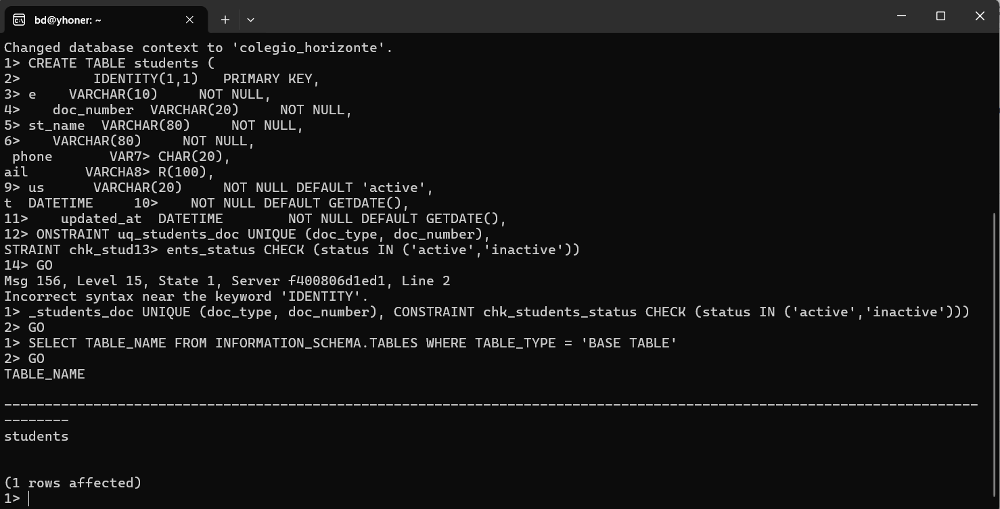

## 4.3 Creación de la base de datos y tablas

Se creó la base de datos `colegio_horizonte` y las 8 tablas del sistema escolar. El script original en PostgreSQL fue adaptado a T-SQL, reemplazando `SERIAL` por `IDENTITY(1,1)`, `TIMESTAMP` por `DATETIME` y `CURRENT_TIMESTAMP` por `GETDATE()`. Al finalizar, se verificó la existencia de todas las tablas con la siguiente consulta:

```sql
CREATE DATABASE colegio_horizonte;
GO
USE colegio_horizonte;
GO

SELECT TABLE_NAME FROM INFORMATION_SCHEMA.TABLES WHERE TABLE_TYPE = 'BASE TABLE'
GO
```

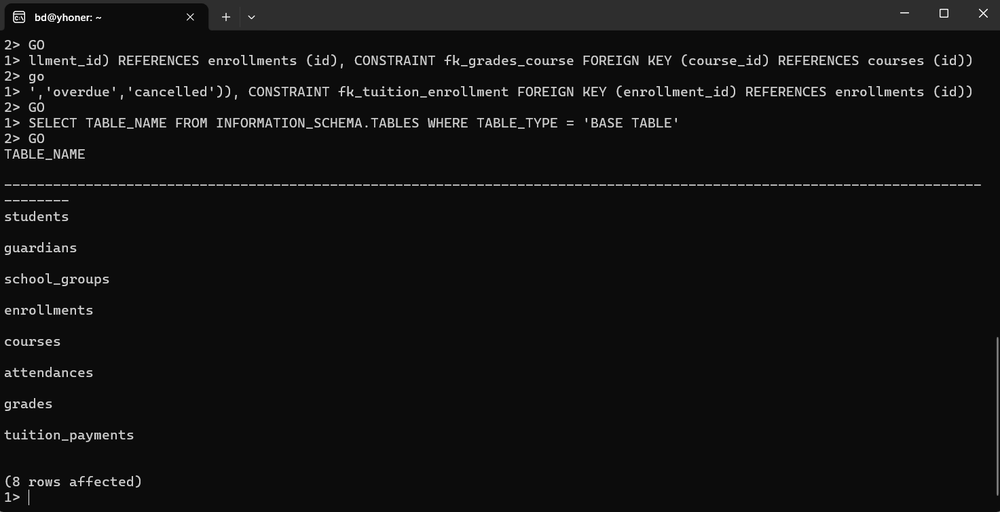

## 4.4 Conexión desde DBeaver

Se configuró la conexión en DBeaver con los parámetros del servidor SQL Server. Fue necesario activar la opción **Trust Server Certificate** para evitar errores de validación del certificado autofirmado del contenedor:

- **Host:** `172.18.57.107`
- **Port:** `1433`
- **Database:** `colegio_horizonte`
- **Authentication:** SQL Server Authentication
- **Usuario:** `sa`

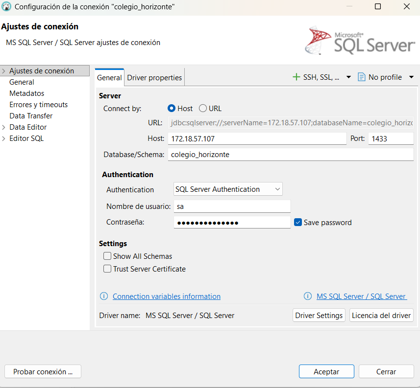

Una vez establecida la conexión, se verificaron las tablas en el explorador y se generó el diagrama entidad-relación:

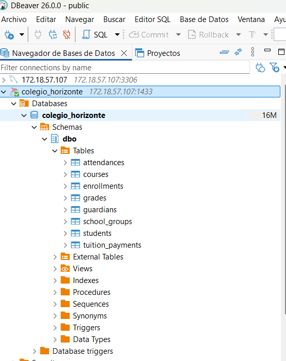

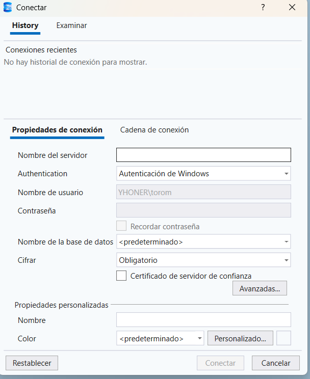

## 4.5 Conexión desde SQL Server Management Studio (SSMS)

Se realizó adicionalmente la conexión desde **SSMS**, herramienta oficial de Microsoft para la administración de SQL Server. La configuración incluyó el uso de autenticación SQL Server y la activación del certificado de confianza:

- **Servidor:** `172.18.57.107`
- **Autenticación:** SQL Server
- **Usuario:** `sa`
- **Cifrado:** Opcional
- **Confiar en certificado:** ✅

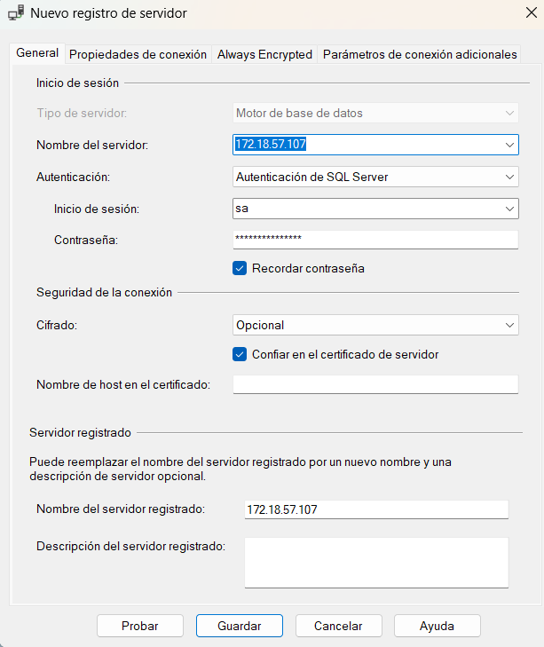

En el explorador de objetos de SSMS se confirmó la presencia de las 8 tablas bajo el esquema `dbo`:

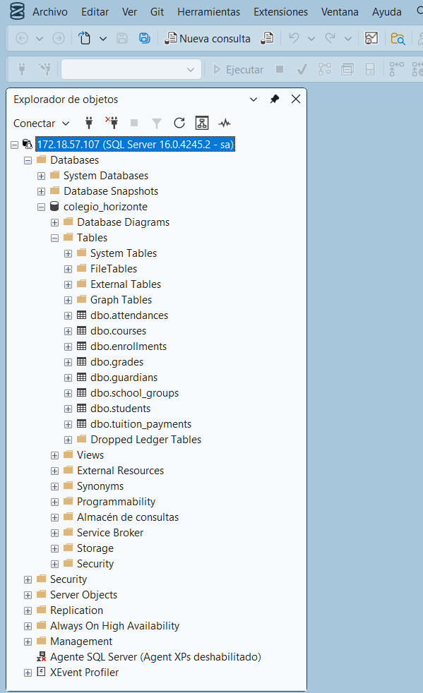

Finalmente, se generó el diagrama de base de datos desde el diseñador de SSMS, visualizando de forma gráfica todas las relaciones del modelo:

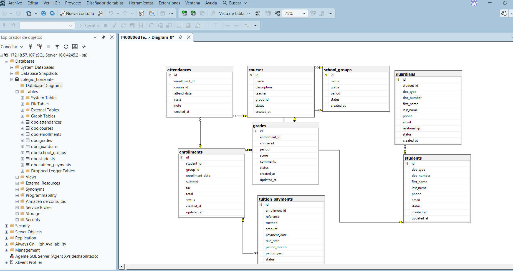

---

# 5. Motor Oracle

## 5.1 Levantamiento del contenedor

Se verificó el estado del contenedor de Oracle y se procedió a iniciarlo. Para recuperar la contraseña del usuario administrador `sys`, se consultó la configuración del contenedor mediante `docker inspect`, lo que permitió identificar que la contraseña configurada era `123456789`:

```bash
docker start oracle-xe
docker inspect oracle-xe | grep -i password
```

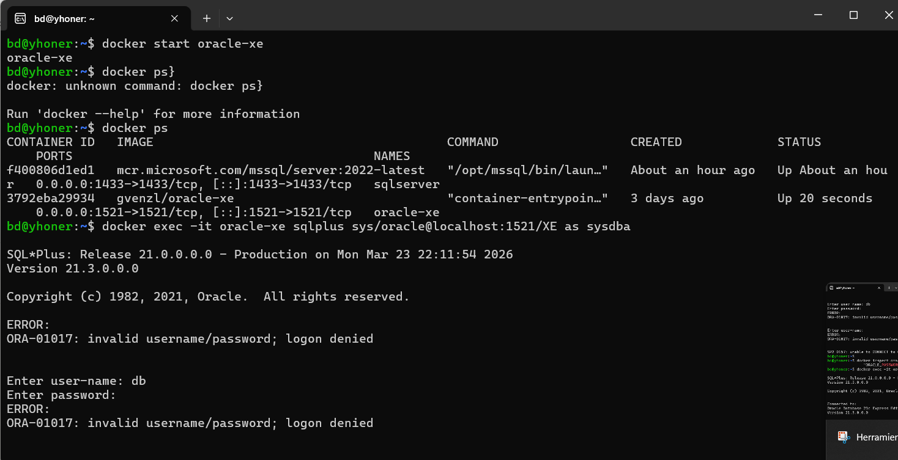

## 5.2 Acceso al motor como administrador

Con las credenciales identificadas, se accedió al motor Oracle como `sysdba` a través de SQL*Plus. La conexión fue exitosa, confirmando la disponibilidad de **Oracle Database 21c Express Edition**:

```bash
docker exec -it oracle-xe sqlplus sys/123456789@localhost:1521/XE as sysdba
```

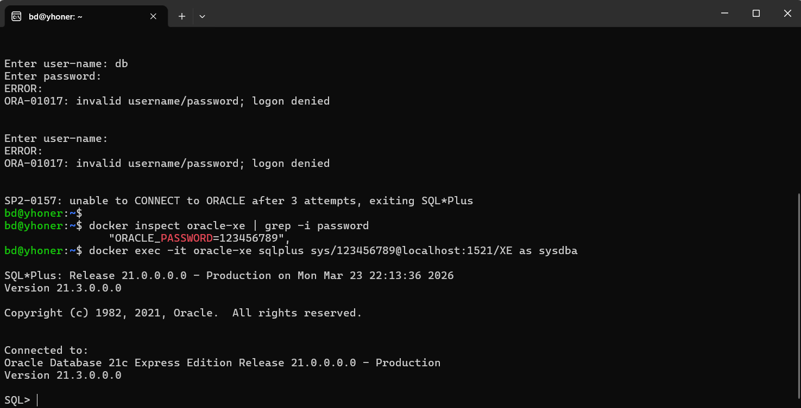

## 5.3 Creación del usuario y esquema

En Oracle, a diferencia de los demás motores, no se crean bases de datos independientes por proyecto. En su lugar, cada usuario representa un esquema propio dentro de la instancia. Se creó el usuario `colegio_horizonte` con su contraseña y se le otorgaron los permisos necesarios para operar:

```sql
CREATE USER colegio_horizonte IDENTIFIED BY colegio123;
GRANT CONNECT, RESOURCE TO colegio_horizonte;
GRANT UNLIMITED TABLESPACE TO colegio_horizonte;
```

El motor respondió con `User created` y `Grant succeeded`, confirmando la correcta creación del esquema.

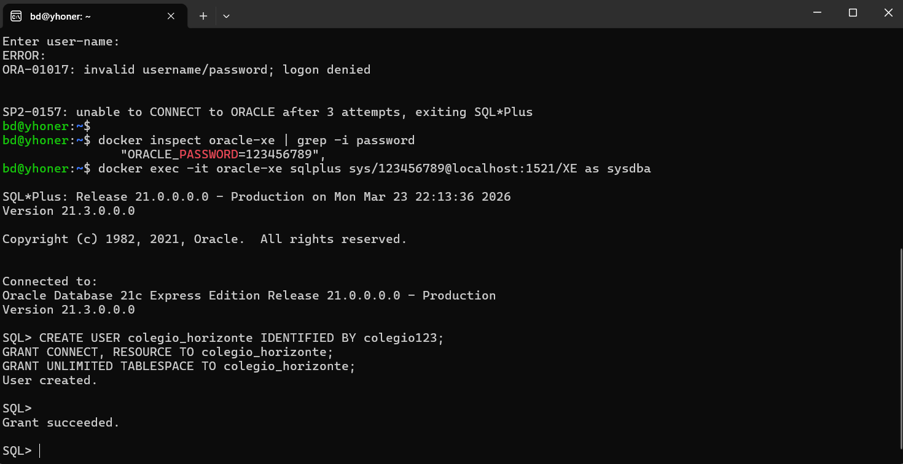

## 5.4 Configuración de permisos en XEPDB1

Al intentar conectarse desde DBeaver, se presentó el error `ORA-01045: user COLEGIO_HORIZONTE lacks CREATE SESSION privilege`. Esto ocurrió porque DBeaver se conecta por defecto a la base de datos pluggable **XEPDB1**, que es un contenedor lógico independiente dentro de la instancia Oracle, diferente a la base de datos raíz `XE`.

Para resolverlo, se ingresó como `sysdba` directamente en `XEPDB1` y se otorgaron nuevamente los permisos necesarios:

```bash
docker exec -it oracle-xe sqlplus sys/123456789@localhost:1521/XEPDB1 as sysdba
```

```sql
GRANT CREATE SESSION TO colegio_horizonte;
GRANT CONNECT, RESOURCE TO colegio_horizonte;
GRANT UNLIMITED TABLESPACE TO colegio_horizonte;
```

Los tres comandos respondieron con `Grant succeeded`, permitiendo continuar el proceso desde las herramientas cliente.

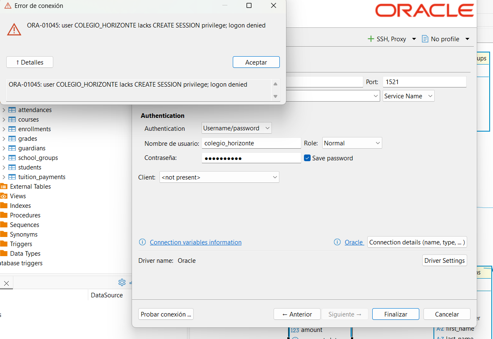

## 5.5 Creación de las tablas

Con el usuario correctamente configurado en `XEPDB1`, se procedió a crear las 8 tablas del sistema. El script fue adaptado desde PostgreSQL a la sintaxis de Oracle, realizando las siguientes conversiones:

| PostgreSQL | Oracle |
|---|---|
| `SERIAL` | `NUMBER GENERATED ALWAYS AS IDENTITY` |
| `VARCHAR` | `VARCHAR2` |
| `TEXT` | `CLOB` |
| `SMALLINT` | `NUMBER(2)` |
| `NUMERIC(n,m)` | `NUMBER(n,m)` |

Cada tabla fue ejecutada como una sola línea de comando para evitar los errores de sintaxis propios del intérprete interactivo de SQL*Plus, respetando el orden de creación según las dependencias de llaves foráneas.

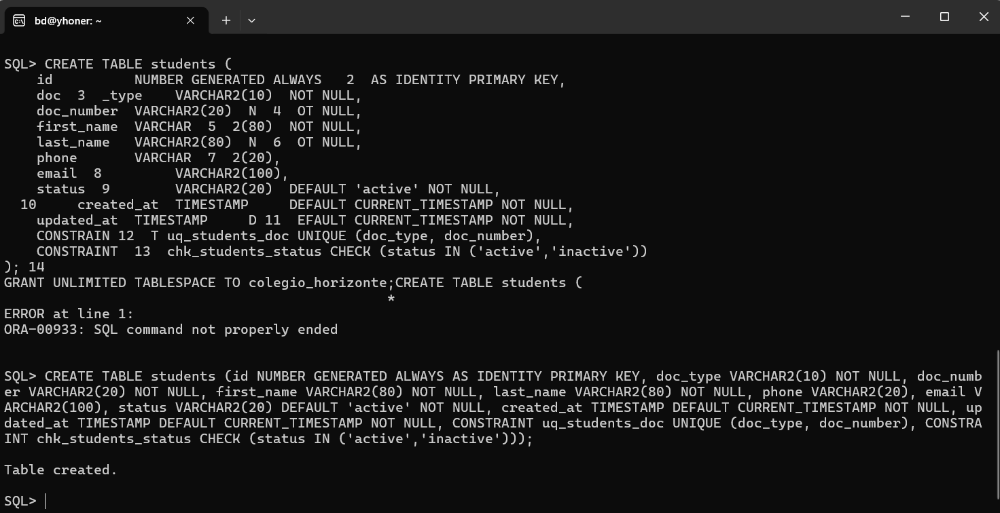

## 5.6 Conexión desde DBeaver

Con los permisos correctamente configurados, se estableció la conexión en DBeaver apuntando a la base de datos pluggable `XEPDB1`:

- **Host:** `172.18.57.107`
- **Port:** `1521`
- **Database:** `XEPDB1`
- **Connection Type:** Service Name
- **Usuario:** `colegio_horizonte`
- **Contraseña:** `colegio123`

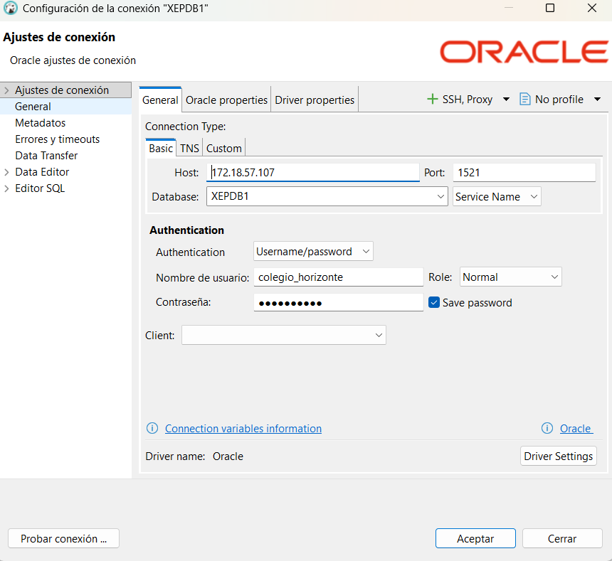

La conexión fue exitosa. En el explorador de bases de datos se visualizó el esquema `COLEGIO_HORIZONTE` con sus 8 tablas correctamente listadas bajo la carpeta **Tablas**:

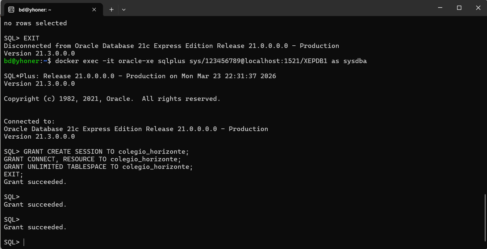

Se generó el diagrama entidad-relación desde DBeaver, el cual mostró de forma gráfica todas las relaciones del modelo, incluyendo las llaves foráneas entre `ENROLLMENTS`, `STUDENTS`, `SCHOOL_GROUPS`, `COURSES`, `ATTENDANCES`, `GRADES`, `TUITION_PAYMENTS` y `GUARDIANS`:

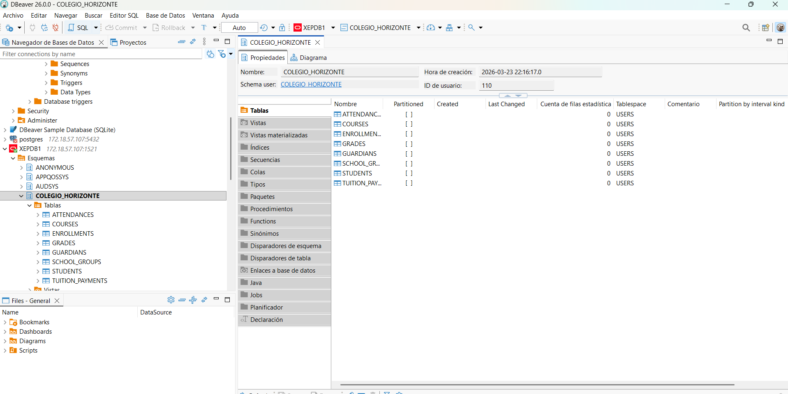

## 5.7 Verificación final del esquema

Se abrió la vista de propiedades del esquema `COLEGIO_HORIZONTE` en DBeaver, donde se confirmó que las 8 tablas fueron creadas correctamente el día `2026-03-23` y se encuentran almacenadas en el tablespace `USERS`:

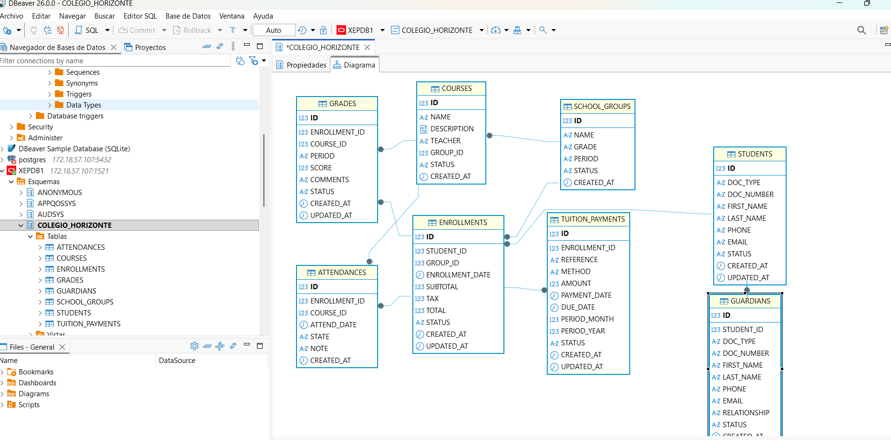